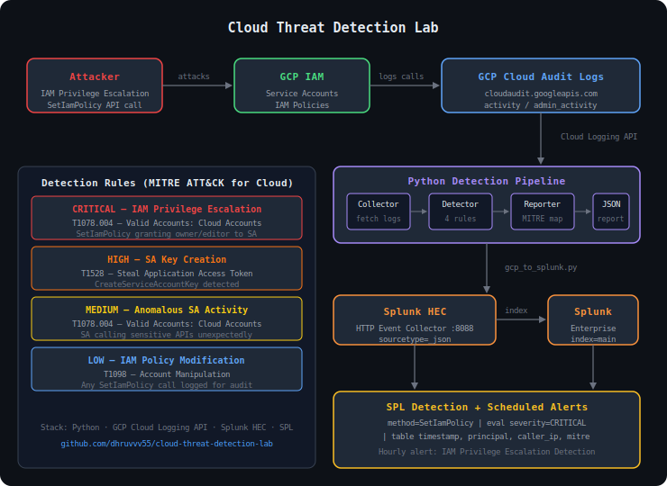
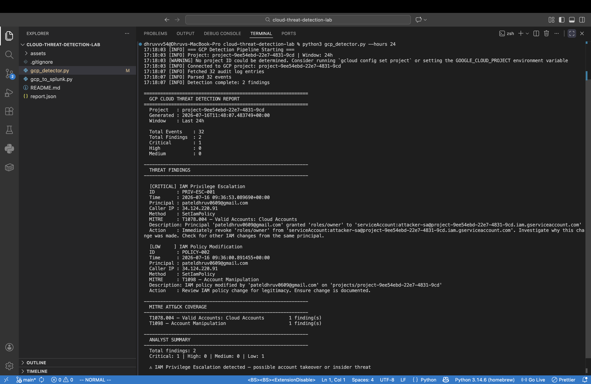
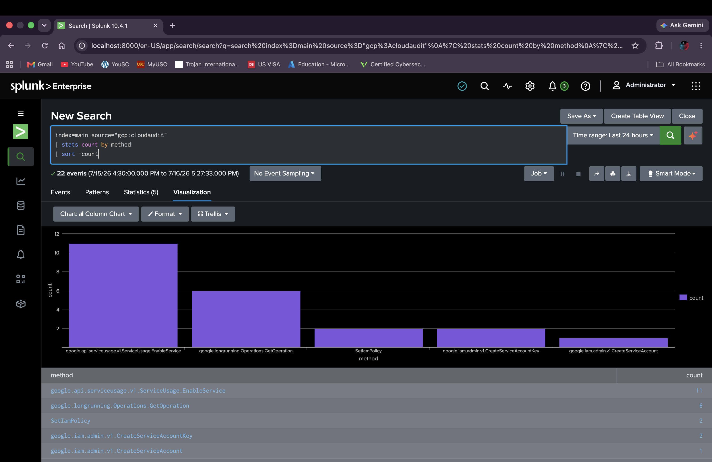

# Cloud Threat Detection Lab

Simulated IAM attack scenarios on GCP, detected using a Python pipeline and Splunk SPL rules.

## Architecture



## What I Did

Set up a GCP project, created a low-privilege service account, then simulated an attacker escalating it to `roles/owner` via `SetIamPolicy`. GCP Cloud Audit Logs captured every API call. From there I built two things:

1. **gcp_detector.py** — pulls audit logs via the Cloud Logging API, runs detection rules, maps findings to MITRE ATT&CK, and outputs a structured incident report
2. **gcp_to_splunk.py** — forwards those same logs into Splunk via HEC, where I wrote SPL detection queries and set up a scheduled hourly alert

## Attack Scenarios

**IAM Privilege Escalation (T1078.004)**

Created a service account with viewer-only access, then granted it `roles/owner`:

```bash
# Low privilege to start
gcloud projects add-iam-policy-binding PROJECT_ID \
  --member="serviceAccount:attacker-sa@PROJECT_ID.iam.gserviceaccount.com" \
  --role="roles/viewer"

# Escalate to owner
gcloud projects add-iam-policy-binding PROJECT_ID \
  --member="serviceAccount:attacker-sa@PROJECT_ID.iam.gserviceaccount.com" \
  --role="roles/owner"
```

Cloud Audit Logs recorded the `SetIamPolicy` call with caller IP, principal, timestamp, and exact policy delta.

## Detection Rules (Python)

| Severity | Rule | MITRE |
|---|---|---|
| CRITICAL | IAM Privilege Escalation | T1078.004 |
| HIGH | Service Account Key Creation | T1528 |
| MEDIUM | Anomalous SA API Activity | T1078.004 |
| LOW | IAM Policy Modification | T1098 |

## Results

### Python Detection Pipeline



32 real GCP audit log events analyzed. 2 findings -- 1 CRITICAL (IAM Privilege Escalation), 1 LOW (IAM Policy Modification). MITRE ATT&CK techniques T1078.004 and T1098 mapped automatically with recommended remediation actions.

### Splunk Analysis



22 GCP audit log events forwarded into Splunk via HEC. Bar chart shows `SetIamPolicy` calls alongside other API activity -- the attack method stands out clearly against baseline traffic.

**SPL Detection Query:**

```spl
index=main source="gcp:cloudaudit" method="SetIamPolicy"
| eval severity="CRITICAL", mitre="T1078.004 - Valid Accounts: Cloud Accounts"
| table timestamp, principal, caller_ip, method, severity, mitre
| sort -timestamp
```

Saved as a scheduled hourly Splunk alert -- **GCP IAM Privilege Escalation Detection** -- which fired automatically on the next run after the attack.

## Stack

- GCP Cloud Audit Logs
- Python 3.9+ / google-cloud-logging
- Splunk Enterprise (local) / HEC
- SPL

## Setup

```bash
# Auth
gcloud auth application-default login
gcloud auth application-default set-quota-project YOUR_PROJECT_ID

# Install
pip install google-cloud-logging google-auth python-dotenv requests

# Run detector
python gcp_detector.py --hours 24

# Forward to Splunk
python gcp_to_splunk.py --hours 24
```

## Project Structure

```
cloud-threat-detection-lab/
├── gcp_detector.py       # Python threat detection pipeline
├── gcp_to_splunk.py      # GCP to Splunk HEC forwarder
├── assets/
│   ├── architecture.svg
│   ├── python-output.png
│   └── splunk-bar-chart.png
└── README.md
```

## Author

**Dhruv Patel** — MS Cybersecurity Engineering, USC  
